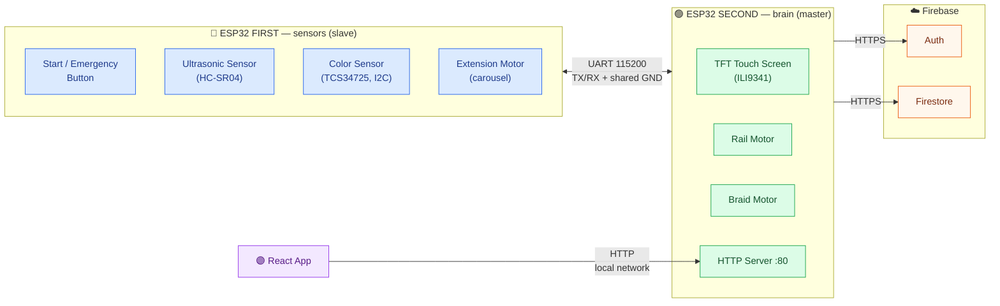

# 🪢 AutoBraid

AutoBraid is an autonomous hair-braiding machine: two ESP32 microcontrollers coordinate motors,
sensors, and a touchscreen to dispense a hair extension and braid it in, while a React + Firebase
web app handles customer registration, machine access codes, and order history. It's a full-stack,
multidisciplinary project — embedded firmware, distributed microcontroller communication, a web
frontend, cloud backend, and a physical, 3D-printed mechanical build.

---

## Demo

🎥 **[Demo video](https://drive.google.com/file/d/1u_yvwhhGyoFPkr-3GAMNtI0DH4gLbsko/view?usp=sharing)** —
access is by request; if you don't have permission yet, open the link and use Drive's "Request
access" button.

TODO: INSERT DEMO VIDEO LINK (replace the link above once a public/unrestricted copy is ready)

The video demonstrates the full workflow: machine startup, touchscreen code entry and extension
selection, the sensor checks (distance + optional hair-color scan), the extension carousel
dispensing, the braiding mechanism running, and a completed order. See [docs/demo.md](docs/demo.md)
for the shot list this video is expected to cover.

---

## Key Engineering Features

- **Dual ESP32 architecture** — a master (screen, motors, cloud) and a slave (sensors, emergency
  button, extension motor), coordinating over a hand-rolled UART protocol
- **Touchscreen control** — ILI9341 TFT with resistive touch, driving the entire user-facing flow
- **UART communication** — 115200-baud ASCII protocol, async request/poll with timeouts, never
  blocking either board
- **Motor-control system** — three steppers, two different driver topologies (unipolar via
  ULN2003, bipolar via L298N), all non-blocking
- **Stepper motors** — 28BYJ-48 x3, driving the rail, the braid mechanism, and the extension
  carousel
- **Rail mechanism** — vertical positioning for the braiding process
- **RGB sensing** — TCS34725 color sensor, resolving "match my hair" extension requests
- **Distance sensing** — HC-SR04 ultrasonic sensor, gating braiding on correct hair positioning
- **Emergency handling** — a single button doing double duty as confirm/all-clear and
  emergency-stop, with immediate motor de-energizing
- **State-machine-based firmware** — both boards run explicit, non-blocking state machines; no
  `delay()` in the control path
- **React frontend** — registration, login, machine-code generation, and order history
- **Firebase integration** — Auth + Cloud Firestore, accessed only through the master ESP32's HTTP
  API (never directly from the app)
- **Custom mechanical design** — braiding, rail, and carousel-dispenser mechanisms
- **3D-printed components** — part of the physical build (see [Mechanical Design](docs/mechanical_design.md)
  for what's documented so far)

---

## System Architecture



**Division of roles:** the second board is the master — it drives the screen, the rail+braid
motors, and talks to Firebase. It also runs a small HTTP server that the React app calls into (the
app never talks to Firebase directly — see [react-app/src/api.js](react-app/src/api.js)). The first
board is the slave: it reports distance/color readings on request, reports the emergency button,
**and also drives the extension carousel motor on request from the second board** — moved there
because the second board (with its soldered-on screen) doesn't have enough free pins for all 3
motors.

**Non-blocking design:** both boards run as explicit state machines, ticked once per `loop()`
iteration — see [docs/state_machines.md](docs/state_machines.md) for the full diagrams. Nothing — not a
touch, not a UART reply, not a motor move — blocks the board while waiting; each step is "enter once,
poll every tick until done". This keeps the emergency button and the app's HTTP requests responsive
at all times, including mid-motion.

For a deeper block diagram and per-board responsibility breakdown, see
[docs/hardware_architecture.md](docs/hardware_architecture.md). For the full user-facing and
system-level flow, see [docs/system_flow.md](docs/system_flow.md).

---

## Hardware

Full parts list, quantities, and roles: [hardware/BOM.md](hardware/BOM.md) (see also
[components.md](components.md) for the original narrative version).

---

## Embedded Architecture

Two ESP32 boards, each running a separate Arduino sketch:

- **`first_esp32` (slave / sensors board)** — the start/emergency button, the ultrasonic sensor,
  the color sensor, and (for pin-budget reasons — see
  [docs/hardware_architecture.md](docs/hardware_architecture.md)) the extension/carousel motor.
- **`second_esp32` (master / brain)** — the touchscreen UI, the rail and braid motors, WiFi +
  Firebase, and the HTTP server the React app talks to. Its session logic is one 25-state state
  machine — see [docs/state_machines.md](docs/state_machines.md).

Every function in both sketches (and in the React app's data layer) is catalogued in
[function_map.md](function_map.md).

---

## Communication

The two boards talk over UART2 (115200 baud, ASCII lines terminated with `\n`). Full message
table, wiring, and a sequence diagram of a normal session: [docs/uart_protocol.md](docs/uart_protocol.md).

| Direction | Command | Meaning |
|-------|--------|--------|
| SECOND → FIRST | `DIST?` | request a distance reading |
| SECOND → FIRST | `COLOR?` | request a hair-color scan |
| SECOND → FIRST | `ARMED` / `DISARM` | start/stop monitoring the emergency button |
| SECOND → FIRST | `PING` | connectivity check |
| SECOND → FIRST | `DISP:<n>` | turn the extension carousel to position n (0-3, negative = none) |
| FIRST → SECOND | `DIST:<cm>`, `DISTOK:<0\|1>` | distance + whether it's valid |
| FIRST → SECOND | `COLOR:<name>` | `Green/Red/Blonde/Black/Unknown` |
| FIRST → SECOND | `EMG` | emergency button pressed during braiding |
| FIRST → SECOND | `OK` | "all clear" confirmation after an emergency |
| FIRST → SECOND | `PONG` | reply to PING |
| FIRST → SECOND | `DISPDONE` | the extension carousel finished turning |

> ⚠️ **UART wiring:** `FIRST_TX(17) → SECOND_RX(16)`, `FIRST_RX(16) → SECOND_TX(17)`, and a shared
> GND between the boards is mandatory. Don't use RX0/TX0 (GPIO3/GPIO1) for this link — that's
> UART0, used by USB (flashing + Serial Monitor).

---

## Sensors

- **HC-SR04 ultrasonic** (first board, `TRIG=21`, `ECHO=19`) — checks the head/hair is within
  `DIST_MIN_CM`–`DIST_MAX_CM` (7.0–16.0 cm) before braiding starts.
- **TCS34725 RGB color sensor** (first board, I2C `SDA=32`/`SCL=26`, LED=`33`) — resolves the
  "match my hair" extension color by matching raw RGB+Clear samples against 4 calibrated reference
  colors.

---

## Motors and Actuators

Three 28BYJ-48 steppers, driven two different ways — see
[docs/mechanical_design.md](docs/mechanical_design.md) for the full breakdown:

| Motor | Board | Driver | Pins |
|---|---|---|---|
| Extension motor (carousel) | first (slave) | ULN2003, unipolar | `2, 15, 18, 5` |
| Rail motor | second (master) | L298N, bipolar | `26, 25, 14, 13` |
| Braid motor | second (master) | ULN2003, unipolar | `27, 33, 32, 3` (GPIO3=RX0, disconnect while flashing) |

> ⚠️ The rail motor's L298N phase table is **not interchangeable** with the ULN2003 motors' phase
> table — see the warning comment in `second_esp32/Motors.ino`.

---

## Mechanical Design

The physical build includes a braiding mechanism, a vertical rail mechanism, and a rotating
extension carousel/dispenser, plus 3D-printed structural parts. See
[docs/mechanical_design.md](docs/mechanical_design.md) for what's documented from the code, and
[hardware/mechanical/](hardware/mechanical/) for where CAD/STL files belong (currently empty —
owner TODO).

---

## Web Application

A Vite + React app (`react-app/`) for registration, login, generating a machine access code, and
viewing order history (customer + admin views). It talks **only** to the second board's HTTP server
— never directly to Firebase (`react-app/src/firebase.js` initializes a Firebase SDK client-side
but is unused; kept for reference).

```
react-app/
  ├─ vite.config.js          Vite build config + Vitest test config
  ├─ src/api.js              talks to the second board's HTTP server (register/login/codes/orders)
  ├─ src/api.test.js         unit tests for api.js — run with `npm test`
  ├─ src/firebase.js         unused — kept for reference, nothing imports from it
  └─ src/pages/              Login/Register/Dashboard/Booking/MyAppointments/Admin
```

### Firebase data structure (Cloud Firestore)

```
users/{uid}   = { name, email, role }
codes/{code}  = { uid, name, used, createdAt }               // created by the app, validated by the machine
orders/{id}   = { uid, name, extensions, hairColor, status, createdAt }  // written by the machine, read by the app
```

---

## Safety

A single physical button on the first board serves as both confirm/all-clear (when idle) and
emergency stop (during braiding), gated by an `armed` flag. On an emergency: both motors are
immediately de-energized, the session is saved with status `"emergency"` (code kept valid for a
retry), and the rail always returns to its home position before the machine resets. Full detail —
including what's implemented vs. only a future idea (watchdog, timeouts, hardware cutoff):
[docs/safety.md](docs/safety.md).

---

## Repository Documentation

| Document | Covers |
|---|---|
| [docs/PROJECT_ANALYSIS.md](docs/PROJECT_ANALYSIS.md) | Repo audit — strengths, gaps, recommendations |
| [docs/project_overview.md](docs/project_overview.md) | Concise, interview-ready project summary |
| [docs/hardware_architecture.md](docs/hardware_architecture.md) | Block diagram, per-board responsibilities |
| [docs/state_machines.md](docs/state_machines.md) | Both boards' state machines, as diagrams |
| [docs/uart_protocol.md](docs/uart_protocol.md) | UART message table + sequence diagram |
| [docs/mechanical_design.md](docs/mechanical_design.md) | Braiding/rail/carousel mechanisms, 3D-printed parts |
| [docs/system_flow.md](docs/system_flow.md) | End-to-end user + system flow |
| [docs/safety.md](docs/safety.md) | Implemented safety behavior vs. future ideas |
| [docs/demo.md](docs/demo.md) | Demo video shot list |
| [docs/images/README.md](docs/images/README.md) | Recommended photos (none added yet) |
| [hardware/BOM.md](hardware/BOM.md) | Bill of materials |
| [components.md](components.md) | Original narrative bill of materials |
| [function_map.md](function_map.md) | Every function in the project, what it does |

---

## Setup and running it

### ESP32 boards (Arduino IDE)

1. Open `first_esp32/` and `second_esp32/` as two separate sketches.
2. Required libraries:
   - `TFT9341Touch` (by Avi Hayun) — for the screen.
   - `Firebase Arduino Client Library for ESP8266 and ESP32` (Mobizt) — for Firebase.
3. On the second board, copy `second_esp32/Secrets.h.example` to a new file named
   `second_esp32/Secrets.h` (not in git) and fill in: WiFi details, Firebase keys, and the device
   account.
   > If left unfilled, the board runs in **demo mode**: any 4-digit code is accepted, the name is
   > "Guest", and the order is only logged to Serial (handy for testing the hardware with no network).
4. On the second board, set **Tools → Partition Scheme → "Huge APP (3MB No OTA/1MB SPIFFS)"**.
   The default partition scheme only allows a 1.2MB app, and this sketch (Firebase + TLS +
   WebServer + the display library, combined) is ~1.3MB — it won't fit and flashing will fail with
   `Sketch too big`. `first_esp32` is small enough that its default scheme is fine.
5. Flash each sketch to its matching board.

### The app

```bash
cd react-app
npm install
# edit ESP32_URL in src/api.js to your second board's local IP (printed on Serial at boot)
npm run dev
```

---

## Future Improvements

Ideas only — none of these are implemented; see [docs/safety.md](docs/safety.md) and
[docs/state_machines.md](docs/state_machines.md) for the full lists these are drawn from:

- Drive the rail's segmented-lowering logic during braiding (currently defined in `Config.h` but
  not wired up — see `second_esp32/Motors.ino`).
- Watchdog timer, motor/sensor/UART timeouts beyond the existing per-request retries, and a
  hardware-level emergency cutoff independent of the microcontrollers.
- A dedicated `FAULT` state distinct from the button-triggered `ST_EMERGENCY`.
- UART protocol hardening: ACK, retry, checksum/CRC, additional framing.
- Populate [hardware/mechanical/](hardware/mechanical/) with real STL/STEP files, and
  [docs/images/](docs/images/) with real photos.

---

## File Structure

```
README.md                    this file
function_map.md               every function in the project, what it does, and the logic flow
components.md                 bill of materials — every physical part and what it's for
docs/                          architecture, state machines, UART, mechanical, safety, flow, demo docs
hardware/                      bill of materials (hardware/BOM.md) + mechanical CAD/STL folders

first_esp32/                 first ESP32 (sensors + extension motor) — one file per component
  ├─ Config.h                pins and constants (no secrets — nothing to configure here)
  ├─ first_esp32.ino         setup/loop, UART, emergency-button monitoring
  ├─ buttom_switch.ino       start/emergency button
  ├─ Ultrasonic_esp32.ino    ultrasonic sensor
  ├─ TCS34725_Color_sensor.ino  color sensor (I2C)
  └─ Dispenser.ino           extension motor (carousel) — non-blocking, remote-controlled over UART

second_esp32/                second ESP32 (master) — one file per module
  ├─ Config.h                pins, motor parameters, WiFi/Firebase (via Secrets.h)
  ├─ Secrets.h.example       template for Secrets.h — copy it, fill in your own values (see Setup below)
  ├─ Secrets.h                your real WiFi/Firebase values — not in git, you create this yourself
  ├─ second_esp32.ino        the main session state machine (the whole flow)
  ├─ DisplayManager.ino      ← the screens (keypad, extension choice, messages)
  ├─ Motors.ino              rail + braid motors
  ├─ UartLink.ino            communication with the first board (incl. carousel requests)
  └─ FirebaseManager.ino / AuthManager.ino / WebServer.ino  ← Firebase + the app's HTTP API

react-app/                   React app
  ├─ vite.config.js          Vite build config + Vitest test config
  ├─ src/api.js              talks to the second board's HTTP server (register/login/codes/orders)
  ├─ src/api.test.js         unit tests for api.js — run with `npm test`
  ├─ src/firebase.js         unused — kept for reference, nothing imports from it
  └─ src/pages/              Login/Register/Dashboard/Booking/MyAppointments/Admin
```
