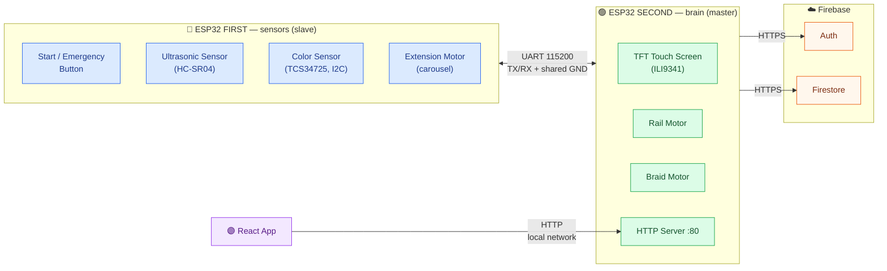

# 🪢 AutoBraid — Autonomous Hair-Braiding Machine

An embedded system with **2 ESP32 boards** talking over **UART**, a **React** app with **Firebase**
on the backend, a touch screen, 3 stepper motors, and 2 sensors.

---

## 🧠 Architecture



**Division of roles:** the second board is the master — it drives the screen, the rail+braid
motors, and talks to Firebase. It also runs a small HTTP server that the React app calls into
(the app never talks to Firebase directly — see [react-app/src/api.js](react-app/src/api.js)).
The first board is the slave: it reports distance/color readings on request, reports the
emergency button, **and also drives the extension carousel motor on request from the second
board** — moved there because the second board (with its soldered-on screen) doesn't have
enough free pins for all 3 motors.

**Non-blocking design:** both boards run as explicit state machines, ticked once per `loop()`
iteration. Nothing — not a touch, not a UART reply, not a motor move — blocks the board while
waiting; each step is "enter once, poll every tick until done". This keeps the emergency button
and the app's HTTP requests responsive at all times, including mid-motion. See the state list at
the top of [second_esp32/second_esp32.ino](second_esp32/second_esp32.ino) and the non-blocking
carousel logic in [first_esp32/Dispenser.ino](first_esp32/Dispenser.ino).

---

## 🔄 Full logic flow

1. **App:** the user registers/logs in (email+password) and taps "Code for machine" → a 4-digit
   temporary code is generated and stored under `codes/{code}`.
2. **Machine screen:** keypad → the user types the code → the board validates it against Firebase
   and fetches the name.
3. `"Hi <name>"` → **choosing up to 3 extensions**: MyHair (match my hair color) / Green / Red /
   Blonde / Black / None.
4. `"INSERT HAIR"` → confirm (START).
5. The second board asks the first for a **distance check** (ultrasonic). If MyHair was chosen,
   the first board scans the hair color and returns the closest match.
6. The **extension motor** (carousel) turns a **quarter turn** to each position in order and
   dispenses; the user takes it.
7. **Braiding:** the rail lowers and the braid motor spins — for one minute, or until stopped.
8. **Emergency:** pressing the button on the first board → `EMG` → the second board stops the
   braid → waits for an "all clear" confirmation → **resets** (rail goes back up) → returns to
   the start.
9. **Normal finish:** the rail goes up, the user confirms, and the order is saved under
   `orders/{id}`. Shown in the app as order history.

---

## 🔌 Wiring (pin map)

### ESP32 FIRST — sensors + extension motor (no screen → plenty of free pins)

| Component | Pins |
|------|-------|
| Start/emergency button | `27` (INPUT_PULLUP) |
| HC-SR04 ultrasonic | `TRIG=21`, `ECHO=19` |
| TCS34725 color sensor (I2C) | `SDA=32`, `SCL=26`, `LED=33` |
| Extension motor (ULN2003, carousel) | `2, 15, 18, 5` — clean, no conflicts |
| UART → second board | `TX=17`, `RX=16` |

### ESP32 SECOND — screen + rail/braid motors

| Component | Pins |
|------|-------|
| TFT screen (VSPI) | `SCK=18`, `MOSI=23`, `MISO=19`, `CS=5`, `DC=4`, `T_CS=15`, `T_IRQ=35` |
| Rail motor (ULN2003) | `26, 25, 14, 13` — clean, no conflicts |
| Braid motor / stepper 1 (ULN2003) | `27, 33, 32, 3` — clean (GPIO3=RX0, disconnect while flashing) |
| UART → first board | `TX=17`, `RX=16` (regular pins; the ESP32 routes UART2 to any GPIO) |

> ⚠️ **UART wiring:** `FIRST_TX(17) → SECOND_RX(16)`, `FIRST_RX(16) → SECOND_TX(17)`,
> **and a shared GND between the boards is mandatory**.
>
> ⚠️ **Don't use RX0/TX0** (GPIO3/GPIO1) for the link between the boards — that's UART0, used by
> USB (flashing + Serial Monitor). The ESP32 routes `Serial2` to pins 16/17 in software, no
> dedicated pins needed.
>
> ℹ️ **Why the extension motor is on the first board:** on the second board (with its soldered
> screen) the pin budget is completely full — screen (6) + UART (2) + 2 motors (8) = 16, plus
> `GPIO0/1` are inaccessible and `GPIO21/22` are faulty on this specific board. After rail+braid
> there's only one free pin left (`GPIO3`), not enough for another motor. So the extension motor
> is driven remotely over UART — the second board sends `DISP:<n>` and the first board (which has
> plenty of free pins) does the actual turning.
>
> ⚠️ **GPIO3 (braid motor IN4) is RX0** — it must be disconnected while flashing the second board,
> and reconnected once flashing succeeds.

---

## 📡 UART protocol (ASCII lines, terminated with `\n`)

| Direction | Command | Meaning |
|-------|--------|--------|
| SECOND → FIRST | `DIST?` | request a distance reading |
| SECOND → FIRST | `COLOR?` | request a hair-color scan |
| SECOND → FIRST | `ARMED` / `DISARM` | start/stop monitoring the emergency button |
| SECOND → FIRST | `PING` | connectivity check |
| SECOND → FIRST | `DISP:<n>` | turn the extension carousel to position n (0-3, negative = none) |
| FIRST → SECOND | `DIST:<cm>`, `DISTOK:<0\|1>` | distance + whether it's valid |
| FIRST → SECOND | `COLOR:<name>` | `Green/Red/Blonde/Black/Unknown` |
| FIRST → SECOND | `EMG` | emergency button pressed during braiding |
| FIRST → SECOND | `OK` | "all clear" confirmation after an emergency |
| FIRST → SECOND | `PONG` | reply to PING |
| FIRST → SECOND | `DISPDONE` | the extension carousel finished turning |

---

## 🗂️ Firebase data structure (Cloud Firestore)

```
users/{uid}   = { name, email, role }
codes/{code}  = { uid, name, used, createdAt }               // created by the app, validated by the machine
orders/{id}   = { uid, name, extensions, hairColor, status, createdAt }  // written by the machine, read by the app
```

The app never talks to Firestore directly — every one of these reads/writes goes through the
second board's HTTP server ([second_esp32/WebServer.ino](second_esp32/WebServer.ino) +
[AuthManager.ino](second_esp32/AuthManager.ino) +
[FirebaseManager.ino](second_esp32/FirebaseManager.ino)).

---

## ⚙️ Setup and running it

### ESP32 boards (Arduino IDE)

1. Open `first_esp32/` and `second_esp32/` as two separate sketches.
2. Required libraries:
   - `TFT9341Touch` (by Avi Hayun) — for the screen.
   - `Firebase Arduino Client Library for ESP8266 and ESP32` (Mobizt) — for Firebase.
3. On the second board, copy `second_esp32/Secrets.h.example` to a new file named
   `second_esp32/Secrets.h` (not in git) and fill in: WiFi details, Firebase keys, and the device
   account.
   > If left unfilled, the board runs in **demo mode**: any 4-digit code is accepted, the name is
   > "Guest", and the order is only logged to Serial (handy for testing the hardware with no network).
4. Flash each sketch to its matching board.

### The app

```bash
cd react-app
npm install
# edit ESP32_URL in src/api.js to your second board's local IP (printed on Serial at boot)
npm run dev
```

---

## 📁 File structure

```
first_esp32/                 first ESP32 (sensors + extension motor) — one file per component
  ├─ Config.h                pins and constants
  ├─ first_esp32.ino         setup/loop, UART, emergency-button monitoring
  ├─ buttom_switch.ino       start/emergency button
  ├─ Ultrasonic_esp32.ino    ultrasonic sensor
  ├─ TCS34725_Color_sensor.ino  color sensor (I2C)
  └─ Dispenser.ino           extension motor (carousel) — non-blocking, remote-controlled over UART

second_esp32/                second ESP32 (master) — one file per module
  ├─ Config.h                pins, motor parameters, WiFi/Firebase (via Secrets.h)
  ├─ second_esp32.ino        the main session state machine (the whole flow)
  ├─ DisplayManager.ino      ← the screens (keypad, extension choice, messages)
  ├─ Motors.ino              rail + braid motors
  ├─ UartLink.ino            communication with the first board (incl. carousel requests)
  └─ FirebaseManager.ino / AuthManager.ino / WebServer.ino  ← Firebase + the app's HTTP API

react-app/                   React app
  ├─ src/api.js              talks to the second board's HTTP server (register/login/codes/orders)
  ├─ src/firebase.js         unused — kept for reference, nothing imports from it
  └─ src/pages/              Login/Register/Dashboard/MyAppointments
```
