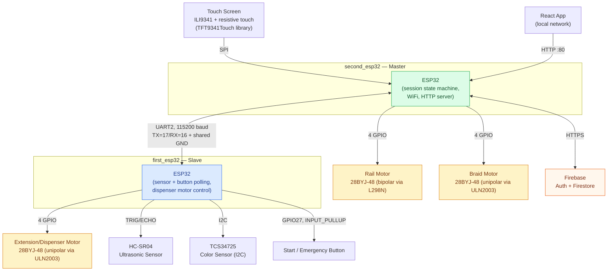

# Hardware Architecture

This document explains the physical/electrical architecture of AutoBraid: which board owns which
peripheral, and how signals flow between them. It's derived directly from `first_esp32/Config.h`,
`second_esp32/Config.h`, `second_esp32/Motors.ino`, and the wiring table in
[README.md](../README.md#-wiring-pin-map) — no pin or peripheral here is invented.

## Why two ESP32 boards

The second board's touchscreen (ILI9341 over SPI, plus 2 touch-controller pins) uses 6 GPIOs by
itself. Add UART (2 pins) and two motors (4 pins each = 8), and the pin budget is exhausted —
`GPIO0`/`GPIO1` aren't usable either. There's exactly one pin left over after the rail and braid
motors (`GPIO3`), not enough for a third motor. So the extension/dispenser motor was moved to the
first board, which has no screen and plenty of free pins, and is driven remotely: the second board
sends `DISP:<n>` over UART, and the first board does the actual stepping. This is a real
pin-budget-driven design decision, not an arbitrary split.

## Block diagram

This matches the task brief's expected shape (touchscreen → master → motors/UART → slave →
sensors/motor/emergency input), with one correction verified against the code: the emergency
button lives on the **slave** (first) board, not as a separate input line into the master — the
master only learns about it via the `EMG` UART message.

## Main ESP32 (second_esp32 — master)

| Responsibility | Module | Notes |
|---|---|---|
| Touchscreen UI | `DisplayManager.ino` | Keypad, extension selection, status/emergency/done screens; polled, non-blocking |
| Rail motor | `Motors.ino` | Bipolar drive via L298N, pins `26,25,14,13` |
| Braid motor | `Motors.ino` | Unipolar drive via ULN2003, pins `27,33,32,3` (GPIO3 = RX0, must be disconnected while flashing) |
| Session state machine | `second_esp32.ino` | 25-state `enum SessionState`, ticked once per `loop()` — see [state_machines.md](state_machines.md) |
| WiFi + Firebase | `FirebaseManager.ino`, `AuthManager.ino` | Code validation, order read/write, register/login |
| HTTP API for the app | `WebServer.ino` | Runs on FreeRTOS Core 0, pinned separately from the state machine on Core 1, so it stays responsive mid-braid |
| Link to the slave board | `UartLink.ino` | UART2 on regular GPIOs 16/17, 115200 baud |

## Secondary ESP32 (first_esp32 — slave)

| Responsibility | Module | Notes |
|---|---|---|
| Start/emergency button | `buttom_switch.ino` | GPIO27, `INPUT_PULLUP`, 50 ms debounce |
| Ultrasonic distance sensing | `Ultrasonic_esp32.ino` | HC-SR04, TRIG=21/ECHO=19, valid range 7.0–16.0 cm |
| Color sensing | `TCS34725_Color_sensor.ino` | I2C, SDA=32/SCL=26, LED enable=33; matches raw RGB+Clear against 4 calibrated reference colors |
| Extension/dispenser motor | `Dispenser.ino` | Unipolar via ULN2003, pins `2,15,18,5`; non-blocking quarter-turn stepping, driven remotely by the master's `DISP:<n>` requests |
| Link to the master board | `first_esp32.ino` | Same UART2 link, opposite end |

## UART link

Both boards use `Serial2` at 115200 baud on pins `TX=17` / `RX=16`, cross-wired
(`FIRST_TX → SECOND_RX`, `FIRST_RX → SECOND_TX`) with a mandatory shared ground. Full protocol
details, message table, and a sequence diagram are in [uart_protocol.md](uart_protocol.md).

## External services

- **Firebase (Auth + Cloud Firestore)** — reached only from the second board over HTTPS. The React
  app never talks to Firebase directly; every request goes through the second board's HTTP API.
  See [../react-app/src/firebase.js](../react-app/src/firebase.js), which initializes a Firebase
  SDK client-side but is unused (no other file imports from it) — kept for reference only.
- **React app** — reaches the second board's HTTP server (`:80`) over the local network only; see
  [system_flow.md](system_flow.md) for the full request path.
