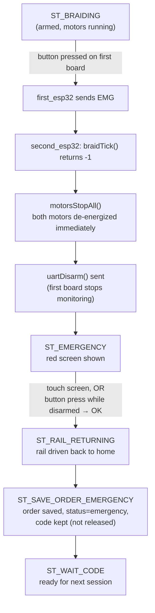

# Safety

This document covers only safety behavior that is actually implemented in the code today, verified
against `first_esp32/first_esp32.ino`, `first_esp32/buttom_switch.ino`,
`second_esp32/second_esp32.ino`, `second_esp32/Motors.ino`, and `second_esp32/UartLink.ino`.

## Currently Implemented

### Emergency button

- A single momentary button (`first_esp32/Config.h`, `BUTTON_PIN = 27`, `INPUT_PULLUP`) serves a
  dual role, gated by the `armed` flag on the first board:
  - **Armed** (during `ST_BRAIDING`, after the master sends `ARMED`) — a press sends `EMG` to the
    master.
  - **Not armed** (everywhere else) — a press sends `OK` (used as a general confirm/all-clear
    signal, including clearing the emergency screen).
- Debounced: a press is only actioned once per `BTN_DEBOUNCE_MS` (50 ms) window
  (`first_esp32.ino`'s `handleButton()`).
- The button is polled every `loop()` iteration on the first board — including while the extension
  carousel is mid-turn — so it's never delayed by a motor move (see `Dispenser.ino`'s non-blocking
  design).

### Motor stopping on emergency

- `braidTick()` (`second_esp32/Motors.ino`) checks a module-level `emergencyRequested` flag every
  tick; on an emergency it immediately calls `releaseCoils()` on the braid motor's pins and returns
  `-1`.
- `stateMachineTick()`'s `ST_BRAIDING` case additionally calls `motorsStopAll()` on that same
  transition, which de-energizes **both** the rail and braid motor coils, not just the one that was
  moving.
- This is an immediate coil de-energize, not a controlled/gradual stop — appropriate for a stepper
  motor, since it doesn't coast.

### Distance checking

- Before braiding, the master requests a distance reading (`DIST?`) from the ultrasonic sensor and
  only proceeds if it's within `DIST_MIN_CM`–`DIST_MAX_CM` (7.0–16.0 cm, `first_esp32/Config.h`).
  Out-of-range or a UART timeout both route to `ST_DIST_BAD`, which shows "Please adjust" and
  retries automatically after 1.5s — it does not silently continue with a bad reading.

### Reset / safe-state behavior after an emergency

- After the emergency screen is cleared, the machine always drives the rail back to its home
  position (`railStartUpHome()`) before doing anything else — the same recovery path used after a
  **normal** finish (`ST_RAIL_RETURNING` is shared between both outcomes).
- The session is saved with an explicit `"emergency"` status distinct from `"completed"`, and —
  unlike a normal session — the temporary code is **not** released/deleted, so the customer isn't
  forced to generate a new one to retry.
- The full state machine unconditionally returns to `ST_WAIT_CODE` afterward, rather than getting
  stuck in any intermediate state.

### User intervention required to resume

- The emergency screen (`ST_EMERGENCY`) only clears on an explicit action — either a touch on the
  screen or an `OK` from the first board (a fresh, non-armed button press) — `uiEmergencyPoll()`.
  There's no automatic timeout that silently resumes braiding.

## Emergency flow (diagram)

## Future Safety Improvements

Not implemented — listed as natural next steps given the current design, not as something planned
or partially built. Do not assume any of these exist when reasoning about failure behavior:

- **Watchdog timer** — nothing currently detects or recovers from a hung board (either ESP32).
- **Motor timeout** — braiding has a fixed 60s duration and stops on `EMG`, but there's no general
  "motor has been running with no progress" watchdog independent of the emergency button.
- **Sensor timeout escalation** — a UART timeout on distance/color today just retries or falls back
  to "Unknown" (see [uart_protocol.md](uart_protocol.md)); there's no escalation if a sensor is
  consistently unreachable (e.g. disconnected) beyond that per-request retry.
- **UART link timeout / health check** — `PING`/`PONG` exists in the protocol but isn't polled
  automatically as a periodic health check anywhere in the current code.
- **Hardware emergency cutoff** — the emergency stop today is entirely firmware-mediated (button →
  GPIO → UART → motor de-energize); there's no hardware-level cutoff independent of the
  microcontrollers.
- **Dedicated FAULT state(s)** — today there's one `ST_EMERGENCY` state for the button-triggered
  case; there's no separate state (or set of states) for other fault conditions (e.g. a sensor that
  stops responding, a UART link that goes silent mid-session).
