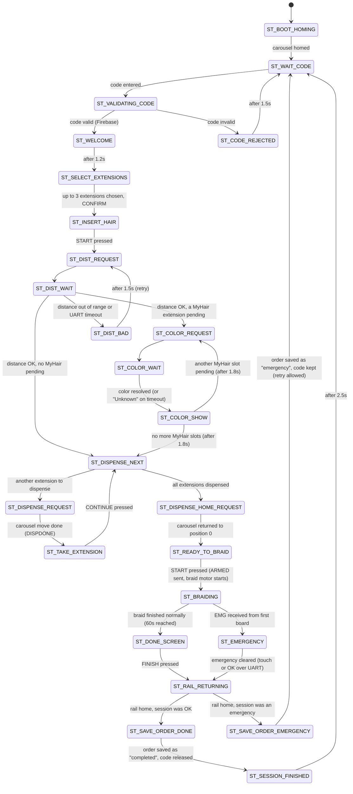
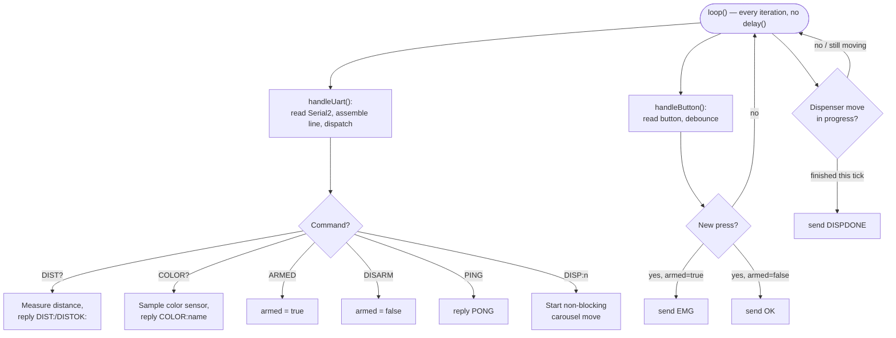

# State Machines

Both boards run explicit, non-blocking state machines — ticked once per `loop()`, no `delay()` in
the hot path. This document is extracted directly from `second_esp32/second_esp32.ino`'s
`enum SessionState` / `stateMachineTick()` and `first_esp32/first_esp32.ino`'s `loop()` /
`handleButton()`. It documents behavior exactly as implemented; it does not redesign anything.

## Master (second_esp32) state machine

25 states, defined in `second_esp32.ino`. Transitions below are taken directly from
`stateMachineTick()`.

### Implemented behavior

### Key events driving transitions

| Event | Source | Effect |
|---|---|---|
| Code entered on keypad | Touchscreen | `ST_WAIT_CODE → ST_VALIDATING_CODE` |
| Firebase code check result | `fbValidateCode()` | Branches to `ST_WELCOME` or `ST_CODE_REJECTED` |
| Extensions confirmed | Touchscreen | `ST_SELECT_EXTENSIONS → ST_INSERT_HAIR` |
| `DISTOK:1` / `DISTOK:0` (or timeout) | UART from first board | Branches `ST_DIST_WAIT` to color/dispense or `ST_DIST_BAD` |
| `COLOR:<name>` (or timeout → "Unknown") | UART from first board | `ST_COLOR_WAIT → ST_COLOR_SHOW` |
| `DISPDONE` (or timeout, continues anyway) | UART from first board | `ST_DISPENSE_REQUEST → ST_TAKE_EXTENSION`, `ST_DISPENSE_HOME_REQUEST → ST_READY_TO_BRAID` |
| START pressed at `ST_READY_TO_BRAID` | Touchscreen | Sends `ARMED`, starts `braidStart()`, `→ ST_BRAIDING` |
| `braidTick()` returns 1 (60s reached) | `Motors.ino`, ticked every loop | `ST_BRAIDING → ST_DONE_SCREEN` |
| `braidTick()` returns -1 (`emergencyRequested`) | Set when `EMG` arrives over UART | `ST_BRAIDING → ST_EMERGENCY`, motors stopped immediately |
| Emergency cleared | Touch on the red screen, or `OK` from the first board | `ST_EMERGENCY → ST_RAIL_RETURNING` |

### Motor-related states

`ST_DISPENSE_REQUEST` / `ST_DISPENSE_HOME_REQUEST` (dispenser, on the first board, via UART),
`ST_BRAIDING` (braid motor, in-place spin, non-blocking `braidTick()`), and `ST_RAIL_RETURNING`
(rail motor moving up, non-blocking `railTick()`) are the three states where a motor is actively
moving. Note the documented gap in `Motors.ino`: `braidTick()` only spins the braid motor — nothing
currently drives the rail *down* during `ST_BRAIDING` (`railSegmentsDone` is never incremented), so
`railStartUpHome()` always computes 0 steps today. This is flagged in-code as a known, not-yet-wired
gap, not a design decision — see [safety.md](safety.md) and the note in `Motors.ino`.

### Sensor-related states

`ST_DIST_REQUEST`/`ST_DIST_WAIT`/`ST_DIST_BAD` (ultrasonic distance check) and
`ST_COLOR_REQUEST`/`ST_COLOR_WAIT`/`ST_COLOR_SHOW` (color scan, only entered if a "MyHair"
extension was selected) are both async request/poll cycles against the first board over UART, with
a timeout handled by `uartPollDistance()`/`uartPollHairColor()`.

### Emergency-related states

`ST_BRAIDING` (where the emergency can occur), `ST_EMERGENCY` (red screen, waiting for clear),
`ST_RAIL_RETURNING` (shared recovery path with the normal-finish flow), and
`ST_SAVE_ORDER_EMERGENCY` (order saved with status `"emergency"`, code kept unused so the customer
can retry with the same code). See [safety.md](safety.md) for the full safety picture.

### Possible future improvements

Not implemented — listed here only because they're natural extensions of the existing design, per
the gaps noted in-code:

- Actually drive the segmented rail-lowering logic that `RAIL_SEGMENT_STEPS`/`RAIL_MAX_SEGMENTS`
  were built for, so `ST_BRAIDING` lowers the rail instead of only spinning the braid motor in
  place.
- A dedicated `ST_FAULT` state distinct from `ST_EMERGENCY`, for conditions other than the button
  (e.g. a UART link that stops responding entirely — see [safety.md](safety.md)).

## Slave (first_esp32) loop logic

`first_esp32` doesn't use a named `enum` state machine — its `loop()` is a flat, always-on poll of
two independent concerns (UART commands, button state) plus one pending-reply flag for the
dispenser motor. It's simple enough to show as a flowchart rather than a formal state diagram.

### Implemented behavior

### Key events

- **`armed` flag** — set by `ARMED` (sent by the master right before `braidStart()`), cleared by
  `DISARM` (sent right after `braidTick()` returns). This flag is the entire emergency-detection
  gate on this board: the same button press means "confirm/clear" when idle and "emergency stop"
  during braiding.
- **Debounce** — a press is only actioned once per `BTN_DEBOUNCE_MS` (50 ms) window, tracked via
  `lastBtnPressed`/`lastBtnChange`.
- **Dispenser move completion** — `dispenserTick()` is polled every `loop()` iteration whenever a
  move is pending, independent of UART/button handling, so a carousel move never blocks the button.

### Possible future improvements

- No formal `enum`-based state machine exists here today (unlike the master board) — the current
  flat poll structure works because there's no multi-step sequencing on this board, but it's listed
  here as a possible future refactor if more behavior is added.
