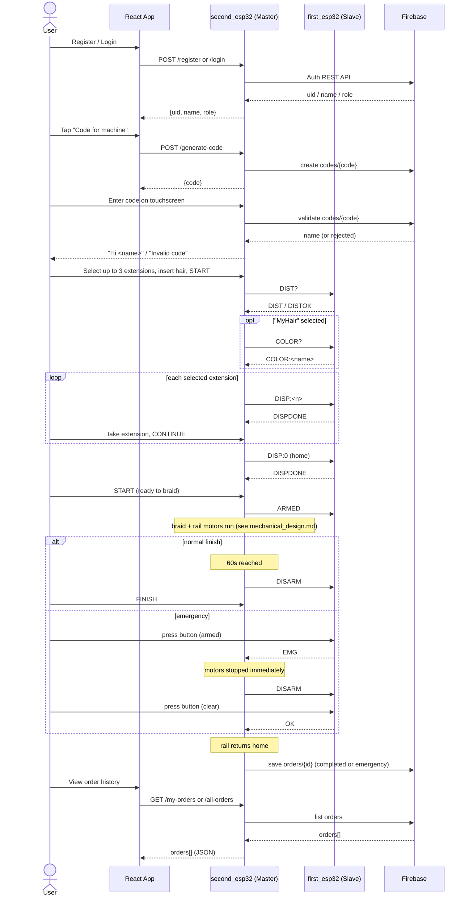
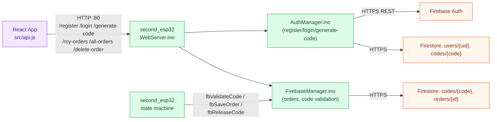

# System Flow

End-to-end walkthrough of what happens when the machine is used, from the user's first tap in the
app to the order landing in Firestore. Cross-references the detailed docs for each subsystem rather
than repeating them.

## High-level flow

```text
User (app)
  ↓  register / log in, tap "Code for machine"
React App  →  HTTP  →  second_esp32 (Master) HTTP server  →  Firebase (Auth + Firestore)
  ↓  4-digit code shown in the app

User (machine)
  ↓
Touchscreen (second_esp32)
  ↓  code entry → validated against Firebase
  ↓  extension selection, insert hair, START
second_esp32 state machine
  ↓  UART: DIST? / COLOR? / DISP:<n>
first_esp32 (Slave)
  ↓  ultrasonic + color sensors, extension carousel motor
  ↓  UART replies
second_esp32 state machine
  ↓  ARMED → braid + rail motors run
  ↓  (button press mid-braid → EMG → emergency stop, see safety.md)
Mechanical action (braiding)
  ↓  rail returns home
second_esp32 → Firebase (order saved: completed or emergency)
  ↓
React App  →  HTTP  →  second_esp32 HTTP server  →  Firebase
  ↓  order shown in "My Appointments" / admin order history
```

## Sequence diagram



## Web/Firebase data flow

The React app never touches Firebase directly — every read/write is proxied through the master
ESP32's HTTP API, which in turn calls Firebase's REST APIs.



## Notes

- The app **never** talks to Firebase directly — every step above that touches Firebase goes
  through the second board's HTTP server (`WebServer.ino` + `AuthManager.ino` +
  `FirebaseManager.ino`). See [hardware_architecture.md](hardware_architecture.md).
- The HTTP server runs on a separate FreeRTOS core (Core 0) from the session state machine
  (Core 1), so app requests (e.g. checking order history) are answered even while the machine is
  mid-braid.
- Full per-state detail is in [state_machines.md](state_machines.md); full UART message detail is
  in [uart_protocol.md](uart_protocol.md); the emergency path is detailed in [safety.md](safety.md).
