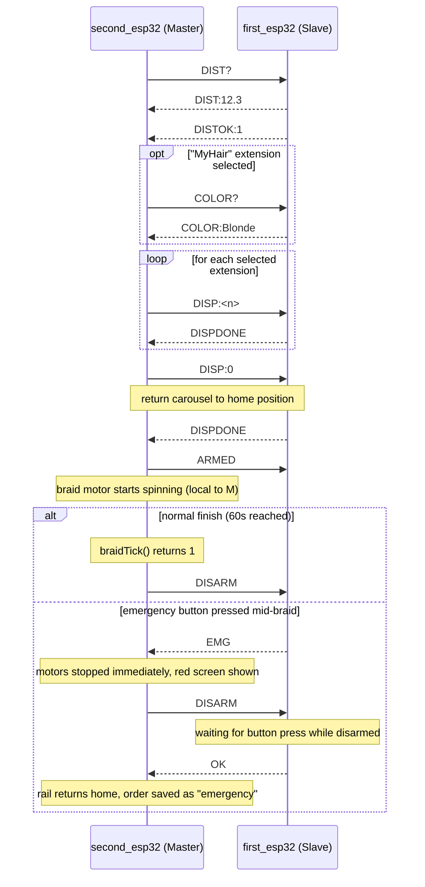

# UART Protocol

The two ESP32 boards communicate over UART2 with plain ASCII lines terminated by `\n`. Documented
exactly as implemented in `second_esp32/UartLink.ino` (sender) and `first_esp32/first_esp32.ino`
(receiver/dispatcher, `processCommand()`), and the reverse direction (`first_esp32/first_esp32.ino`
sender, `second_esp32/UartLink.ino`'s `parseLine()` receiver).

## Link parameters

| Parameter | Value |
|---|---|
| Baud rate | 115200 |
| Framing | `SERIAL_8N1` |
| Second board TX / RX | GPIO17 / GPIO16 |
| First board TX / RX | GPIO17 / GPIO16 |
| Wiring | `FIRST_TX(17) → SECOND_RX(16)`, `FIRST_RX(16) → SECOND_TX(17)`, shared GND (mandatory) |
| Message termination | `\n` (a stray `\r` is also tolerated/stripped) |
| Direction | Bidirectional — SECOND initiates requests, FIRST replies and also sends unsolicited `EMG`/`OK` |

## Messages

| Message | Sender | Receiver | Meaning |
|---|---|---|---|
| `DIST?` | SECOND | FIRST | Request a distance reading |
| `COLOR?` | SECOND | FIRST | Request a hair-color scan |
| `ARMED` | SECOND | FIRST | Start monitoring the button for emergency (braiding is about to begin) |
| `DISARM` | SECOND | FIRST | Stop monitoring for emergency (braiding ended, normally or not) |
| `PING` | SECOND | FIRST | Connectivity check |
| `DISP:<n>` | SECOND | FIRST | Turn the extension carousel to position `n` (0–3; negative = none/home) |
| `DIST:<cm>` | FIRST | SECOND | Measured distance in cm (one decimal) |
| `DISTOK:<0\|1>` | FIRST | SECOND | Whether the distance is within `DIST_MIN_CM`–`DIST_MAX_CM` |
| `COLOR:<name>` | FIRST | SECOND | One of `Green` / `Red` / `Blonde` / `Black` / `Unknown` |
| `EMG` | FIRST | SECOND | Emergency button pressed while `armed == true` |
| `OK` | FIRST | SECOND | Button pressed while `armed == false` (confirm / all-clear) |
| `PONG` | FIRST | SECOND | Reply to `PING` |
| `DISPDONE` | FIRST | SECOND | The extension carousel finished its requested move |

Every SECOND→FIRST request that expects a reply is handled asynchronously on the master side: a
`uartRequestX()` sends the line and starts a timeout; a `uartPollX()`, called every `loop()` tick,
returns "still waiting" / "got a reply" / "timed out" without ever blocking `loop()`. A timed-out
distance or color read is treated as invalid/`Unknown` and the state machine moves on rather than
hanging — see [state_machines.md](state_machines.md).

## Normal communication sequence

The sequence below matches one full session, condensed to the UART exchanges (screen/Firebase
interaction omitted — see [system_flow.md](system_flow.md) for the full picture).

## Possible Future Improvements

Not implemented — the protocol today is fire-and-forget ASCII lines with client-side timeouts only.
Listed here as ideas, not as something planned or partially built:

- Acknowledgment (ACK) for every message, not just the request/reply pairs that already exist
- Automatic retry on a dropped or garbled line
- A checksum or CRC on each message
- Additional message types beyond the 13 above
- Byte-level framing beyond a plain `\n` terminator (e.g. length-prefixed frames)

None of these are implemented today; do not assume they exist when reasoning about failure modes —
see [safety.md](safety.md) for what actually happens when a UART reply is missing or delayed.
